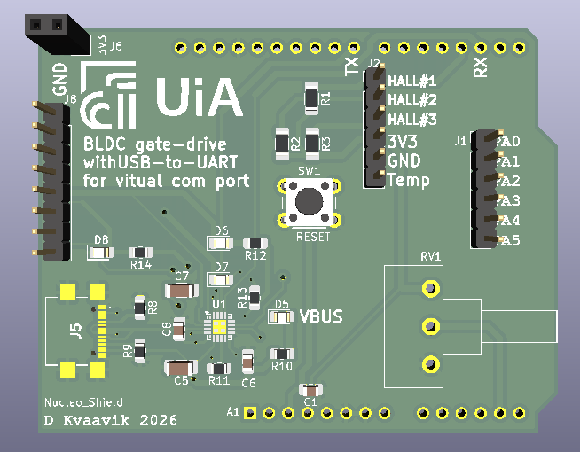

# BLDC Driver
This STM32 NUCLEO-F446RE software project is to support NUCLEO SHIELD Hardware designed to provide a BLDC Motor Driver interface.  
## The Nucleo Shield PCB for BLDC Motor Drive Interface
  

## The pin assignment used for the Nucleo Shield
  

## Driver User interface
Controlling the motor the BLDC Motor Shield provides a single turn potentiometer and a UART to USB interface for serial line communication for command line motor configuration.  

### Single turn potentiometer
The potentiometer will control the motor speed by adusting the PWM's duty cycle.  

### Serial com port 
The Driver software provides also å command line interface that allows the user to set the motor speed.  
