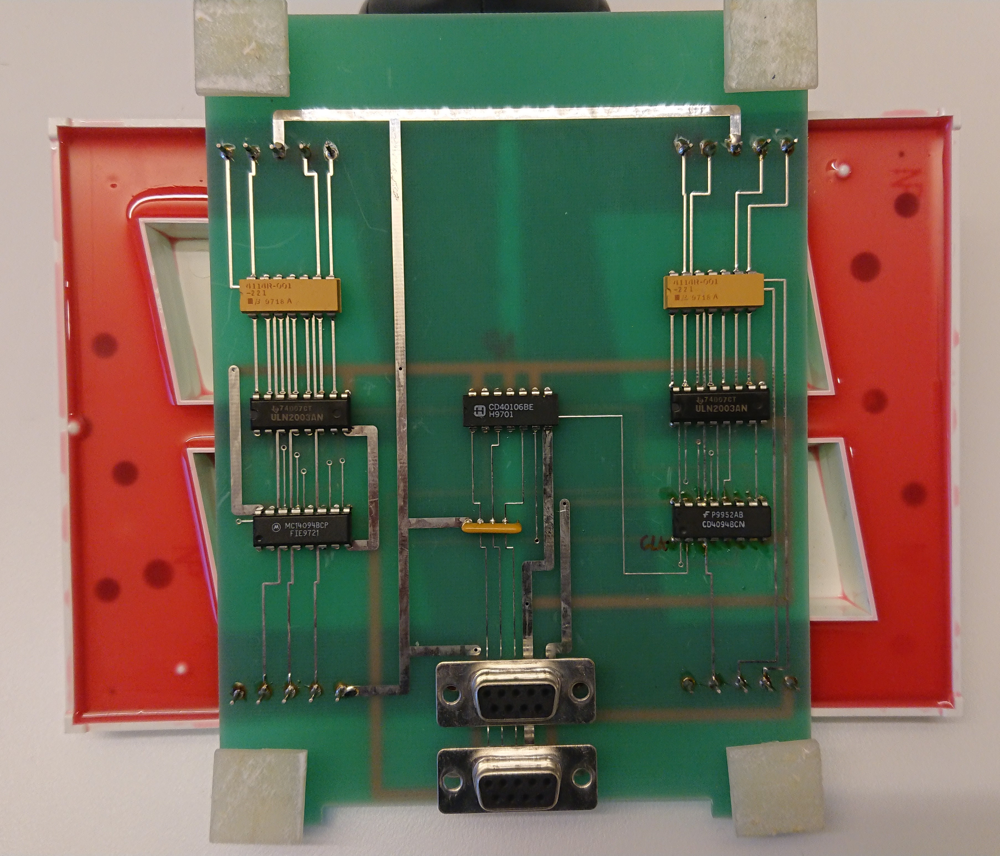

# March 2024 challenge.
## Legacy 7-Segment display with CMOS (15V) hardware driver
Reverse engineering of an Two digit 7-Segment display element without any documentation.  
The hardware will need 12V to illuminate the display segments. See the relevant data sheet for LA4141R-82.  
  
Figure 1: Circuit board for the two 4" 7-Segment displays.  

Each 7-Segment display element is controlled by 8-bit serial to parallel shift register. The 7 bits of the 8-bit parallel output from this register is connected to a High-Current Darlington Transistor Array (ULN2003) that powers the display segments through a 220 ohm resistor array from 4100 Bourns.  

Since the two digit display has two individual display elements, there are two 8-bit serial to parallel shift register connected in cascade. The first shift register is to illuminate the highest value digit, where as the second cascade connected shift register is to illuminate the lowest value digit. This will require that the serial data for both of these display elements are sent in one 2-byte sequence, where the low value is entered first, as the first byte of the sequence, followed by the high value 7-segment data. 

The serial data received by the first shift register will output the serial data on the serial output pin, which is connected to the second shift registers data input pin. Both clock and strobe are shared between the shift registers. 

The first shift register's clock, data and strobe lines are connected to the output CMOS Hex Schmitt-Trigger Inverters. The input of these inverters are connected directly to the display element's 9-pin D-Sub female connector in the following order.  

- D-Sub pin 3 = strobe
- D-Sub pin 4 = data
- D-Sub pin 5 = clock

Using a mcu to provide proper and sufficient serial data for display illumination, a TTL to CMOS 12V level converter is needed, since the display element's logic is CMOS 12V based.

One simple solution is to use one NPN transistor for each control line, making a 3.3V level to a 12V logical "high".


Figure 2: A simple common emitter circuit for TTL to CMOS 12V level shifter - inverted logic. 

12V and GND is connected to the following D-Sub pins
- D-Sub pin 1, 8 and 9 = 12V (Vcc)
- D-Sub pin 1, 6 and 7 = 0V (Ground)   


## The software driver
To provide the necessary serial data for the two digit 7-segment display, a STM32 microcontroller is used.
The microcontroller at hand is a evaluation board with a ARM Cortex -M4 MCU from ST Microelectronics. The evaluation board is the NUCLEOF302R8, with 2 38-pin headers for GPIOs, power and ground for function evaluation.  

For the two digit 7-segment display hardware driver, GPIO PC0, PC1 and PC2 are selected for clock, data and strobe signal, which will give the following shift register signal to MCU GPIO pin connection:

- GPIO PC2 = D-Sub pin 3 = strobe
- GPIO PC1 = D-Sub pin 4 = data   
- GPIO PC0 = D-Sub pin 5 = clock   

The first version of the driver will only consider low speed transmission - only interested to see changes of the display state within one second period.  
This means that it will be sufficient to use ```HAL_Delay()``` for signaling on all GPIO pins used for the transmission to the shift registers.  

Below is the two digit 7-segment display hardware driver implemented on STM32 NUCLEOF302R8 evaluation board.  
```
for (int i = 0; i < 8; i++) {
    // msb (most significant bit) on the line first.
    // The bits enter into the least significant bit of the shift register and  
    // will be shifted towards the most significant bit.

    sLine = (ssCode[digit] >> (7-i)) & 0x1;
    // Data on sData_Pin
    HAL_GPIO_WritePin(GPIOC, sData_Pin, sLine); //PC1 <=> D-SUB#4 = Orange&White = DATA
    HAL_Delay(delay);

    // Clock goes HIGH latching the data Neg. Logic
    HAL_GPIO_WritePin(GPIOC, sClk_Pin, GPIO_PIN_SET); //PC0 <=> D-SUB#5 = Green = CLK
    HAL_Delay(delay);
    //
    HAL_GPIO_WritePin(GPIOC, sClk_Pin, GPIO_PIN_RESET);
    HAL_Delay(delay);
}
```
Slow timing used. Will need to check this and eventually optimize.  

_Transmission speed_  
What would be de minimum frequency for the Clock signal? How quick should the 7-segment display lit up after an update has been sent? Lets assume it is sufficient to update the display after 1 ms, or a few.  

__Running Stopwatch__  
A stopwatch needs at least 4 7-segment display elements or digits, and it will need at least 4 x 8 = 32 clock cycles, which will give a clock signal period equal to 1 ms / 32 = 31.25 µs => 32 kHz.  
The stopwatch to show 10 ms (hundredth of a second) as the smallest time value of a measured time interval.  
more TBD..
___|      