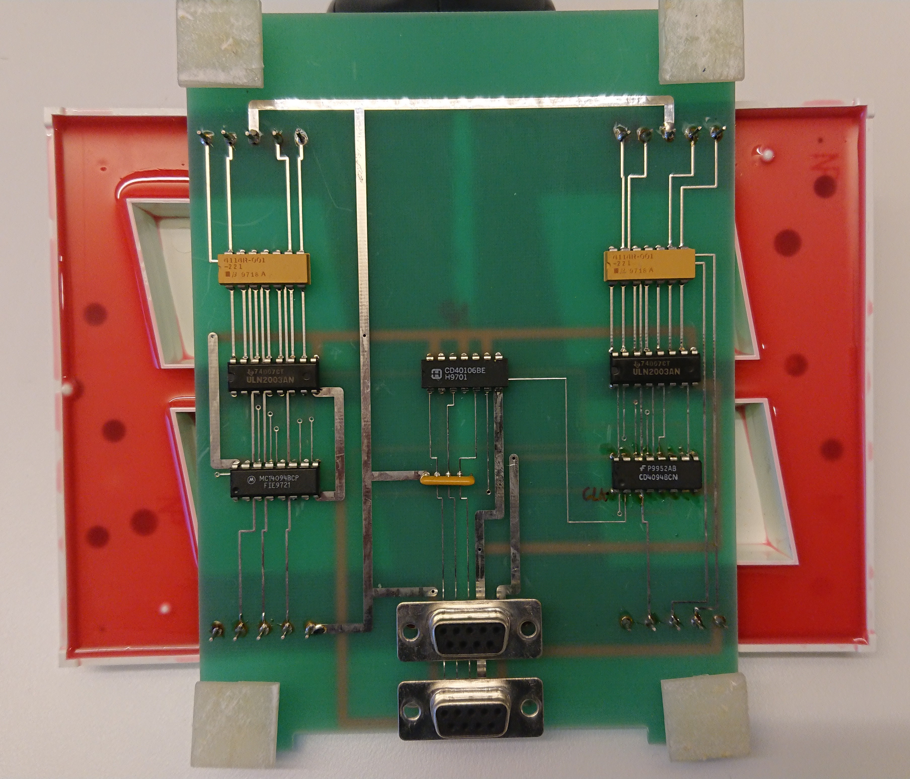
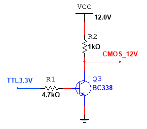
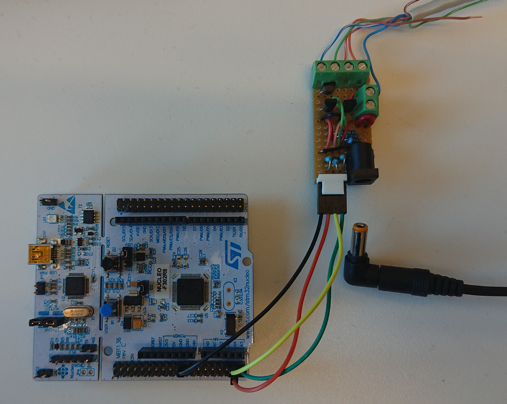

# March 2024 challenge.
## Legacy 7-Segment display with CMOS (15V) hardware driver
Reverse engineering of an Two digit 7-Segment display element without any documentation.  
The hardware will need 12V to illuminate the display segments. See the relevant data sheet for LA4141R-82.  
  
Figure 1: Circuit board for the two 4" 7-Segment displays.  

Each 7-Segment display element is controlled by 8-bit serial to parallel shift register. The 7 bits of the 8-bit parallel output from this register is connected to a High-Current Darlington Transistor Array (ULN2003) that powers the display segments through a 220 ohm resistor array from 4100 Bourns.  

Since the two digit display has two individual display elements, there are two 8-bit serial to parallel shift register connected in cascade. The first shift register is to illuminate the highest value digit, where as the second cascade connected shift register is to illuminate the lowest value digit. This will require that the serial data for both of these display elements are sent in one 2-byte sequence, where the low value is entered first, as the first byte of the sequence, followed by the high value 7-segment data. 

The serial data received by the first shift register will output the serial data on the serial output pin, which is connected to the second shift registers data input pin. Both clock and strobe are shared between the shift registers. 

The first shift register's clock, data and strobe lines are connected to the output CMOS Hex Schmitt-Trigger Inverters. The input of these inverters are connected directly to the Circuit board's 9-pin D-Sub female connector in the following order.  

- D-Sub pin 3 = strobe
- D-Sub pin 4 = data
- D-Sub pin 5 = clock

Using a mcu to provide proper and sufficient serial data for display illumination, a TTL to CMOS 12V level converter is needed, since the display element's logic is CMOS 12V based.

One simple solution is to use one npn transistor for each control line, making a 3.3V level to a 12V logical "high".



Figure 2: A simple common emitter circuit for TTL to CMOS 12V level shifter - inverted logic. 

12V and GND is connected to the following D-Sub pins
- D-Sub pin 1, 8 and 9 = 12V (Vcc)
- D-Sub pin 1, 6 and 7 = 0V (Ground)   


## MCU to Display element hardware interface 
To provide the necessary serial data for the two digit 7-segment display, a STM32 microcontroller is used.
The microcontroller at hand is a evaluation board with a ARM Cortex -M4 MCU from ST Microelectronics. The evaluation board is the NUCLEOF302R8, with 2 38-pin headers for GPIOs, power and ground for function evaluation, and will for sure provide the necessary hardware for the display element interface.   

For the two digit 7-segment display hardware driver, GPIO PC0, PC1 and PC2 are selected for clock, data and strobe signal.  
Each of these GPIOs is connected to the an inverting level converter, which is then connected to the corresponding function pin on the display element's D-Dub connector.   

which will give the following shift register signal to MCU GPIO pin connection:

- GPIO PC2 ==> TTL2cmos ==> D-Sub pin 3 = strobe
- GPIO PC1 ==> TTL2cmos ==> D-Sub pin 4 = data   
- GPIO PC0 ==> TTL2cmos ==> D-Sub pin 5 = clock   

  

Figure 3: Connecting the vero-board implementation of the level converter to the Nucleo board's GPIO PC0, PC1 and PC2  


## The software driver
The driver is written in c and deployed on the STM32 MCU platform for a specific NucleoF302R8 development board.
The integrated development environment is the STM32CubeIDE from ST Electronics and utilizing the Hardware Abstraction Layer library.

### Converting number value to 7-segment data
To display a number of 4 digits on a 4 digit 7-segment display, each digit has to be extracted from the number value in order to convert this into the corresponding coded data that will show this digit's value. For a 4 digit number value the following algorithm is used to extract all 4 digits so that they can be treated separately.  
```
...
uint16_t modulo = 10;
uint16_t digitPos = 1;
uint8_t digits[4];
// Extract digits to send
for (int i = 0; i < 3; i++) {
    digits[i] = (fourDigitNumber%modulo)/digitPos;
    digitPos *= 10;
    modulo *= 10;
}
digits[3] = fourDigitNumber/digitPos;
...
```
Each digit is then mapped to a specific 7-seg display data that represents the digit's value - a 7-segment coding array has been prepared, where the index value points to the coding that represents this index value.  

### Data transmission
The truth table and timing diagram given in the data sheet for the cd4094 and MC14094B describes how the data, clock-signal and strobe has to be handled to transfer data into the display elements shift registers.  

In short, the transferring a '1' the data-line has to stay high for a whole clock-pulse. Latching the shift-register's data onto the parallel output port is done with a single strobe pulse after alle the data has been sent.  


The following code sequence sends data to the display element bit-by-bit.
```
for (int i = 0; i < 8; i++) {
    // msb (most significant bit) on the line first.
    // The bits enter into the least significant bit of the shift register and  
    // will be shifted towards the most significant bit.

    sLine = (ssCode[digits[element]] >> (7-i)) & 0x1;
    // Data on sData_Pin
    HAL_GPIO_WritePin(GPIOC, sData_Pin, sLine); //PC1 <=> D-SUB#4 = Orange&White = DATA
    HAL_Delay(delay);

    // Clock goes HIGH latching the data Neg. Logic
    HAL_GPIO_WritePin(GPIOC, sClk_Pin, GPIO_PIN_SET); //PC0 <=> D-SUB#5 = Green = CLK
    HAL_Delay(delay);
    //
    HAL_GPIO_WritePin(GPIOC, sClk_Pin, GPIO_PIN_RESET);
    HAL_Delay(delay);
}
```  

## Implementing big stopwatch 
A stopwatch needs at least four 7-segment display elements or digits to show seconds and hundredths of a second. To illuminate the correct segments in all four 7-segments display, the MCU will need to send 4 consecutive bytes, considering that 4 serial to parallel shift registers are cascade connected.  

The complete transfer will need 4 x 8 = 32 clock cycles to deliver the data necessary to lit the 7-segments display elements. If this is to happen within 1 ms, the clock frequency will then be:  
1 ms / 32 = 31.25 µs giving a clock frequency of 32 kHz.  

### Cascading two dual 7-segments display elements
The dual 7-segments display elements are not designed for cascading other dual 7-segments display elements. If this is to be pursued, a hardware modification has to be done.  

__Note!__ One important implication is that the output of the second shift register will be inverted by the cascaded display element before it enters the third shift register.  

__!Consider__ to use an additional data-line to transfer the number of hundredths of a second to the dual 7-segment display element.

#### 9-pin D-Sub cable
Standard strait 9-pin D-Sub cables (male <==> female connectors) from _?_ have the following color coding pin-map.    
- Red    = pin 1
- Yellow = pin 2
- Blue   = pin 3
- White  = pin 4   
- Black  = pin 5
- Orange = pin 6
- Pink   = pin 7
- Brown  = pin 8
- Green  = pin 9

### Stop watch functionality
- Start measurement
- Stop Measurement
- Reset  

All of these events must trigger an interrupt service routine.  
Can use one for both start and stop, and a second one for reset - only necessary if lap-time is to be implemented.  
Currently implemented one single isr for all of the stopwatch events.

### Running display during time measurement
Update every 0.1 sec?
 