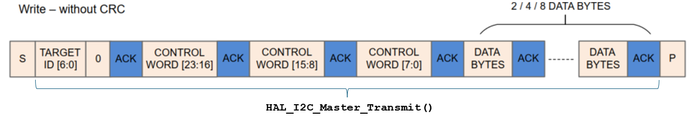
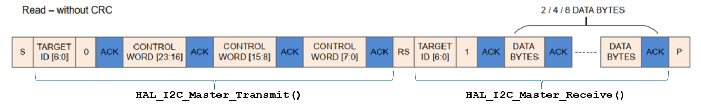

# foc-i2c for I2C communication for system configuration of the MCF8316A
MCF8316A is a Sensor-less Field Oriented Control (FOC) Integrated FET BLDC Driver, that preserves the FOC algorithm's parameters in a EEPROM inside the MCF8316A chip.  
The basic architecture of this device is that it contains an EEPROM and a set of a so called shadow registers.
It is not possible to read the EEPROM content directly, so it must .... see the docs for more details later .. more TBD.

## Writing data into the shadow registers  
HAL_I2C_Master_Transmit()  
 
  

## Reading data from the shadow register  
HAL_I2C_Master_Transmit()  
HAL_I2C_Master_Receive()  

