! Be aware - this document is new and in the making... 
# Development notes for STM32NUCLEO-F302R8 development board
This repository is to contain small code fragments for the STM32NUCLEO-F302R8 development board to understand / get used to the STM32CubeIDE and to make use of some of the features in the STM32-F302R8 device.  
The study/investigation will start with making the LD2 blink. Thereafter make a bidirectional serial line communication that provides a simple command-line terminal user interface from a PC (like PUTTY or TeraTerm).  

This command-line interface should then be extended to provide more and more functions from the micro controller unit.

## Connecting the STM32NUCLEO-F302R8 development board to the software development environment.    
Should be quite simple, but if you have got your hands on a used device, you must ensure that the power (PWR) strap selector is set to U5V (USB 5V supply) in order for the ST-LINK to "see" the STM32-F302R8 chip. 

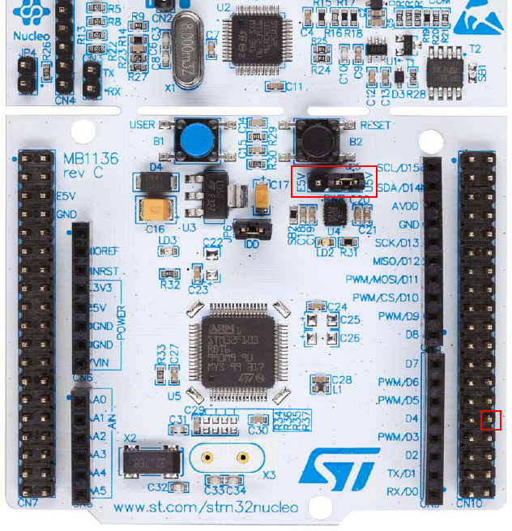  
  

Make also sure that the strap is on the CN3 pin row, connecting the ST-LINK to the STM32-F302R8 chip SWD interface.

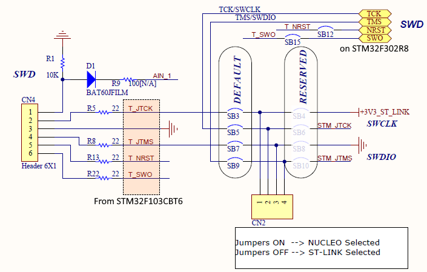  


## Blinking the LD2
What to do...
1. Select the GPIO pion that is physical connected to the LD2.
2. Make the selected GPIO output an output pin.
3. To make the LD2 LED to blink, we have at least two options.  
a. Use the HAL (Hardware Abstraction Layer) functions: HAL_GPIO_TogglePin() + a HAL_Delay() placed in a never ending loop  
b. Use the HAL functions: HAL_GPIO_Write(1) + HAL_Delay() + HAL_GPIO_Write(0) + HAL_Delay() placed in a never ending loop  

This is fairly simple when using the hardware configurator in the STM32CubeIDE,

It is observed that the sw dev tool generates a lot of code and, the first thing noticed is the assembly start-up code startup_stm32f302r8tx.s 

## Pre-compile steps for time-stamping and numbering the latest build
It is usually informative to include some build data in the executable (binary) code, at least for some. For this reason, an include file, appver.h, has been added to the project to contain the last build date and time in addition to the build number. In the project properties and settings, two pre-compile steps are registered. The first is to run a simple python script that will update the   appver.h file with the new date and time immediately before building the executable, and next step tis to move/copy the update appver.h fil into the source-code path to be part of the build process.  

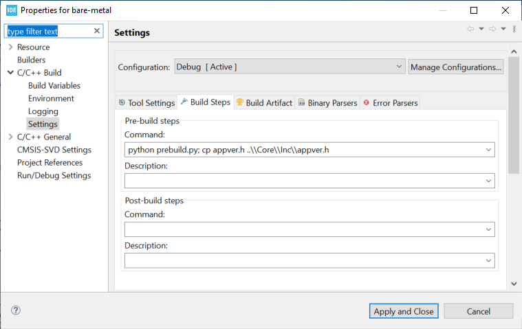  

It should be noted that Python, 3.7 or later, script interpretor has to be installed and the python script, __prebuild.py__, and the __appver.h__ file has to be located in the debug folder, that is: bare-metal\Core\Debug\  

## USART to RS232 communication
The STM32-F302R8 chip contains 3 USART blocks, USART1, USART2 and USART3.  
As USART1 is considered to be the first alternative for reprogram the flash memory, ref. RM0365 Rev 8 p61/1086, we'll use USART2 for MCU serial communication.  

Configuring the STM32-F302R8 to deploy USART2 for 9600 baud, 8-bit payload, 1 start bit and 1 stop bit to comply with the default settings of the PUTTY program on Win10. The Rx and Tx pins for USART2 is found at GPIO pin PC4(TX) and PC5(RX) seen in the pictures below.

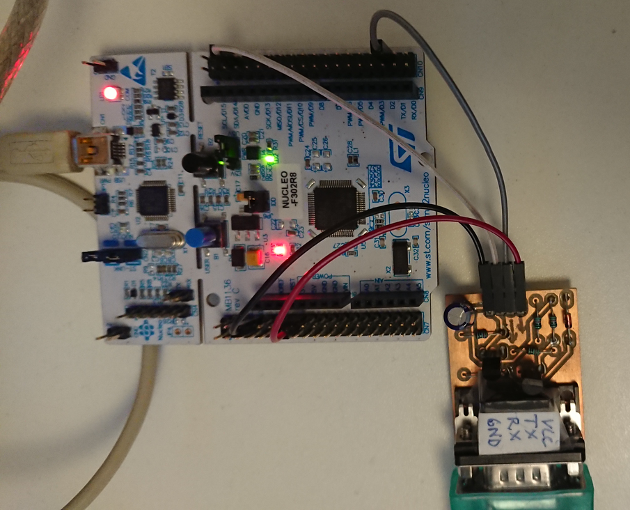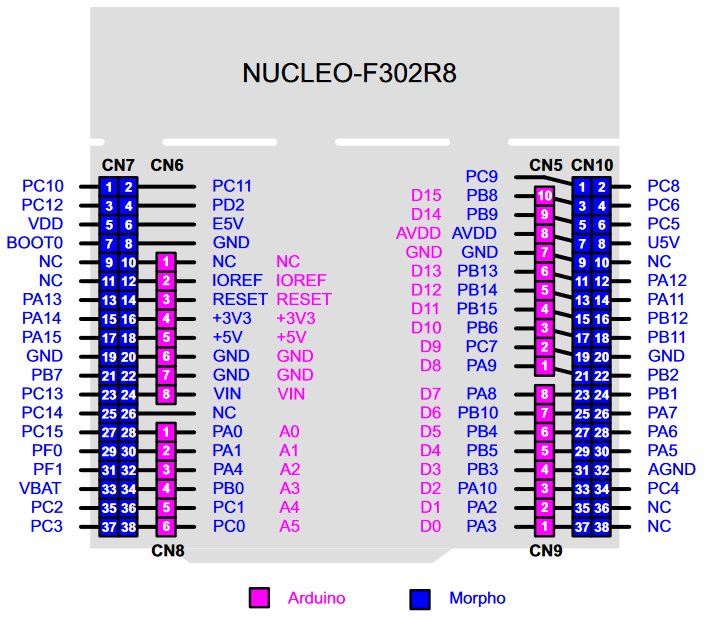


The STM32 software developemt (kit) environment includes a Hardware Abstraction Layer (HAL) for all of its MCUs, which means that the HAL provides a set of functions for most of the hardware for initialization, read and write access and interrupt handling.  

### USART Transmission
For USART2, the __HAL_UART_Transmit()__ will transmit any number of bytes to the TX pin (PC4), but to make a character based serial line user interface, we'll have to send one character at a time in order to confirm to the user that each character has been received correctly. In addition to this, it will be further convenient to map the __HAL_UART_Transmit()__ to the c function __printf()__, which is commonly used i many console applications.

```
/* Private function prototypes -----------------------------------------------*/
void SystemClock_Config(void);
static void MX_GPIO_Init(void);
static void MX_USART1_UART_Init(void);
/* USER CODE BEGIN PFP */
int _write(int fd, char *ptr, int len) {
	HAL_UART_Transmit(&huart1, (uint8_t*) ptr, len, 1000);
	return len;
}
/* USER CODE END PFP */
```

The code above will map a particular implementation (single byte/character implementation) of the ```HAL_UART_Transmit()``` to the ```printf()``` function.  

```__io_putchar()``` could also be an alternative to ```_write()```.

### USART Reception
A traditional character based serial line user interface waits for single keyboard events and prints its value onto the output console.  
This means that the MCU must either do extensive polling to be able to catch the keyboard events, or have a interrupt service routine to be executed whenever a key on the keyboard is pressed.
We'll make use of a interrupt service routine for the particular USART device by including the ```AL_UART_RxCpltCallback```,  which is triggered by explicitly registering repeatedly RX interrupt ```HAL_UART_Receive_IT()```.  

In the callback routine we'll check if the received character is a carriage-RETURN, which indicates that the user command-line input is completed and is to be interpreted as a user command. Otherwise will the callback store the received characters one-by-one in a command-line buffer, which is parsed in command executioner function.  
The following code implements the above functionality.  

```
/* Private user code ---------------------------------------------------------*/
/* USER CODE BEGIN 0 */

char termInputBuffer[80];
int bytesReceived = 0;

void HAL_UART_RxCpltCallback(UART_HandleTypeDef *huart) {
  if (UART1_rxBuffer == 13) {
    if (bytesReceived > 0) {
	  // The user command is complete and is to be executed... - this should actually be a Deferred Procedure Call (DPC),
	  // in order to avoid holding the isr too long. But, for now this is ok, since there are only one isr for the moment.
      executeCmd(&termInputBuffer[0], bytesReceived); 
      bytesReceived = 0;
      memset(termInputBuffer, 0, 80);
    } else {
      promt(); // Output the command-line prompt to indicate that the user interface is ready for a new command.
    }
      // re-trigger the interrupt service callback...
	  HAL_UART_Receive_IT(&huart1, &UART1_rxBuffer, 1);
      return;
  }
  // Echo back the received printable character.
  HAL_UART_Transmit(&huart1, &UART1_rxBuffer, 1, 100);
  
  // Store the received character into the terminal input buffer.
  termInputBuffer[bytesReceived] = UART1_rxBuffer;
  bytesReceived++; // Update the buffer index...
  
  // re-trigger the interrupt service callback...
  HAL_UART_Receive_IT(&huart1, &UART1_rxBuffer, 1);
}
```
  
## Command-line interface
To Be Described  
Keywords  
Command parser and interpretor  
### User commands
Command-line contains a command word and 0 or parameters combined with 0 or more switches in the form of a dash (-) and a alphanumeric letter.  
The command-line parser will separate the command and parameters in order to interpret the user command and execute the appropriated operation.  

__How to design a command-line interface?__  
Bottom-UP: Identify a set of related operations that are to be accessible to the user.  

Example: Imagine that we want to control a LED and decide that it can be set in 3 states, ON, OFF and BLINKING.
This decision may lead us to define the command word to be LED and its parameter for the first two steps, should be either ON or OFF. But should this command set also support the command-line with no parameters? - user only entering the command word LED.  

For this command word, it would be natural to implement and show the LED status, if no parameters are entered with the command word.  
This means that we'll have to make one or more functions that can service the LED command-set.  

Is there a command-line implementation pattern? Not that many... We'll make a simple implementation ourself.  

Possible strategy is as follows:  
 - Make a command-structure for each command(-word)  
 - The command struct is to contain the command-word (string) and all the necessary parameters (list of strings) in addition to a command-support function pointer. 
```
#define COMMAND_PARAMS 10
#define COMMAND_PARAM_LENGTH 10
#define COMMAND_NAME_LENGTH 20
#define NUMBERS_OF_MCU_COMMANDS 2

struct command {
  char name[COMMAND_NAME_LENGTH];  // the command name
  int params;     // room for params numbers of command-parameters
  int maxParamLength; // max param word length.
  char paramWords[COMMAND_PARAMS][COMMAND_PARAM_LENGTH];
  int paramValues[COMMAND_PARAMS];
  void (*cmdFunction)(char*); // the command support function...
};

void LED(char* paramStr){
	printf("%s", paramStr);
}

void dummy(char* paramStr){
	printf("DUMMY\r\n");
}


struct command mcuCmds [NUMBERS_OF_MCU_COMMANDS] = {
  {"LED", 3, 6, {"ON", "OFF", "BLINK"}, {0, 1, 500 }, &LED},
  {"DUMMY", 2, 6, {"TRUE", "FALSE"}, {0, 0}, &dummy}
};

// ...and using this structure in the command execute function...
uint8_t executeCmd(char *termInput, int cmdLength) {
   int i = 0;
   size_t numberOfCommands = sizeof(mcuCmds) / sizeof(mcuCmds[0]);

   // Check if the entered command is part of the command-list for this application.
   for (; i < numberOfCommands; i++) {
 	    if (strncmp(mcuCmds[i].name, termInput, strlen(mcuCmds[i].name)) == 0) {
 		     mcuCmds[i].cmdFunction((char*)&termInput[strlen(mcuCmds[i].name)+1], (int*) &mcuCmds[i].paramValues);
 		     promt();
     	   return 0;
      }
   }

   if (i >= numberOfCommands) {
      printf("\r\nThe command: %s, is not recognized", termInput);
      promt();
      return -1;
   }
   else {
	    return -2; // ...make the compiler happy;-)
   }
}

```
Now that we have a relative simple way of making console user interface commands, we can investigate more functions in the NUCLEO STM32-F302R8 board.  
After deploying and using the command structure, it seems that there are some fields in the struct that are redundant.  
__NOTE!__ Need to reconsider the necessary number of fields in this struct.  

 
What about checking the on-chip ADC?  

### Measuring a AA battery's voltage
At the time of writing this, a need for checking some AA batteries that has been laying around for some time, and it would be nice to have a device that can check if the rest charge or voltage is useful for something.  
__Finding a pin for Analogue to Digital value conversion__  
WE'll use the STM32CubeIDE configurator to allocate and enable a GPIO pin for this function/operation.  
<include a picture of the ADC config...>   
HAL functions used:  
```
HAL_ADC_Start(&hadc1);
HAL_ADCEx_Calibration_Start(&hadc1, ADC_SINGLE_ENDED);

// Poll ADC1 Peripheral & TimeOut = 1mSec
HAL_ADC_PollForConversion(&hadc1, 1);
// Read The ADC Conversion Result - using 3300mV + 400mV offset to
// calculate the analog value
printf("\r\nAA Battery voltage: %ld mV", 
        3700*HAL_ADC_GetValue(&hadc1)/4096);
```
___more TBD...___  

### Timer interrupts
Using the STM32 Advanced-controller timer (TIM1) in __Up-counting mode__  
Note! The TIM1 timer hardware does not "connect" to a global interrupt, which is of interest here, but TIM2 timer hardware does.  

The plan is to implement a set of commands that provide user access to the timers Auto-Reset Register and setting the number of interrupts..   

Through the STM32CubeIDE configurator we assign TIM2 with prescaler equal 1024 (dividing the system clock by 1024) and setting the Auto-Reset Register to 32000.  
The configurator then includes initialization code for the actual timer (TIM2) in addition to the Interrupt service routine block for the this feature.  
This is all fine, but what if we want to change the timer interrupt interval on the fly?  
The HAL macro ```__HAL_TIM_SET_AUTORELOAD()``` does it for us. It takes two arguments, the first the address to the timer handle and the second one the value for the AutoReset Register (ARR).  

The timer kan be started and stopped at any time and the relevant callback routine is ```HAL_TIM_PeriodElapsedCallback()```, which is triggered by the Interrupt Request handler, ```TIM2_IRQHandler(void)```, which is automatically generated by the driver-configurator.

___more TBD...___  
___  
### Be aware - the STM32CubeIDE have generated some more files for us, for now five extra c-files for code cluttering...    
Not that much actually -   
the MCU Support Package (the MSP Initialization code ```stm32f3xx_hal_msp.c```) is updated according to the selections done in the STM32CubeIDE IOC config tool.  
The Interrupt Service Routines for any hardware/software interrupt conditions are placed in the ```stm32f3xx_it.c``` file with relevant callback routines supporting the actual interrupts.  
For system and clock initialization the Integrated Development Environment (IDE) provides us with the ```system_stm32f3xx.c``` file in addition to the ```sysmem.c and syscalls.c``` files.  
___

## Using Timer for PWM operation

___more TBD...___


## I2C Connectivity
Target: Connecting a CO2 sensor (__Sensirion SCD30__) to the STM32NUCLEO-F302R8 board using the sensor's I2C bus.
The _Sensirion SCD30_ is a CO2, humidity and temperature sensor equipped with I2C and UART connectivity interfaces.  
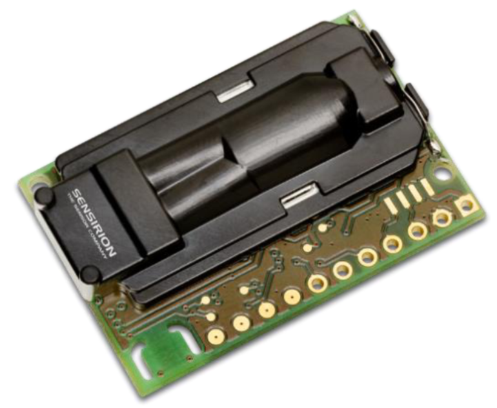  

In the STM32CubeIDE board/Chip configurator we select the hardware for I2C1 connectivity.
Looking into the data sheet for the Sensirion SCD30 device we see that it is a standard speed bus (100kbs), which has to be applied to the configurator.
Other I2C bus configurations needs to be aligned with the sensor's I2C bus requirements, found in the document "Sensirion_CO2_Sensors_SCD30_Interface_Description.pdf".  

__I2C Master and slave set-up__  
The STM32NUCLEO-F302R8 board is to be the I2C master, the Sensirion sensor the I2C slave.

<image of the physical connections of the I2C bus between the STM32NUCLEO-F302R8 board and the Sensirion sensor>  

__Experiences:__  
The I2C bus was interconnected the sensor device and the development board WITHOUT PULL-UP resistors, under the assumption (false) that this was / cloud be provides already by the development board.  
This was of course a silly assumption since all usage of a I2C bus is dependent of what kind of devices that are connected on the bus and what kind of speed it has to support.  

So, to make it work properly, two resistors of 4.7k ohms was connected to 3.3v and each to the I2C bus (SDA & SCL) wires.  

To check that the physical layer behaves as expected, a simple sensor read-out operation was sent from the STM32NUCLEO-F302R8 board, while the SDA and SCL wires was monitored by an oscilloscope.

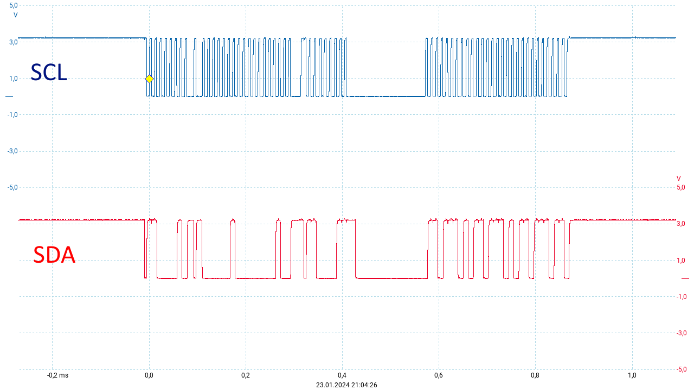  

Master sending ```GET_DATA_READY_STATUS```, which according to the readout seemed to work as expected.   

It was also learned that the single instructions from the Master to the slave sensor should be sent using single I2C write operation, by using the HAL function ```HAL_I2C_Master_Transmit()```.  
So, to check if we could access the sensor, it seemed sensible to ask for the device's version number.  
```
void ReadFirmwareVersion() {
   uint8_t firmwareVersion[4] = {0xd1,0,0,0};
   uint16_t firmware = 0xD100;

   // Send a specific command to the Sensirion I2C slave... the command is a two byte register address...
   HAL_I2C_Master_Transmit(&hi2c1, SENSIRION_ADDRESS, firmwareVersion, 2, 1000);

   if (HAL_I2C_Mem_Read(&hi2c1, SENSIRION_ADDRESS, firmware, I2C_MEMADD_SIZE_16BIT, &firmwareVersion[0], 3, 1000) != HAL_OK) {
      printf("\r\nHAL_I2C_Mem_Read() FAILED!");
   }
   else {
      printf("\r\nSensirion SCD30 Ver.:0x%02x.0x%02x crc=0x%02x", firmwareVersion[0],firmwareVersion[1], firmwareVersion[2]);
   }
}
```
As seen above, the HAL function HAL_I2C_Mem_Read() is sent immediately after the read-register command was sent.

___more TBD...___  

### Ran into the following issue when included the I2C HAL Driver...  
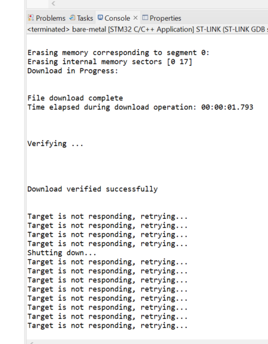  


This was caused by the unfortunate choice of I2C hardware (I2C1 uses PA15 & PA14, which is connected to the JTAG debugger pin).  
Replaced I2C1 with I2C3 to avoid this - new code not tested.  

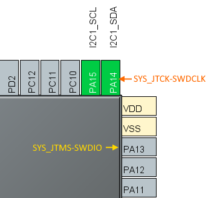

## ongoing work
### Writing a driver for the Hitachi 44780U LCD display controller.
The Hitachi 44780U LCD display controller's hardware interface is an 8-bit parallel instruction/data bus with 3 separate digital control lines, ref (https://cdn-shop.adafruit.com/datasheets/HD44780.pdf)  

According to the display controller's specification the instruction/data bus can be used as a 4-bit bus to reduce the number of I/O connections and thereby enabling it to be used with MCUs with limited I/O pins.
It is this 4-bit instruction/data bus configuration the LCD display driver supports.

__29Jan24__  
First integration test failed - no response on the LCD display...
Need to check the direct GPIO configuration...
- this worked as expected  

While testing this the CO2 sensor started to read data ok, but after a while it failed to read-out the data, which was done every second or so.
conversion interval not registered!  

__01Feb24__  
The "Target is not responding, retrying..." was caused by the use of PA14 & PA15 for I2C, which conflicts with the debugger...  
Changed to I2C2 in the configurator, but after updating the code, the I2C did not work - moved also the pull-ups on the bus, but no success.

Verified control of the GPIO PB0 - PB3 & PB6 - PB8 (more or less)  
Timer_Delay.c did NOT work out of the box.  
Still no output on the Hitachi Display. Seems that we'll have to verify that is works on a Arduino board. The Documentation si scars.  

__01Feb24__  
Found LCD software (LiquidCrystal.cpp & LiquidCrystal.h) that is distributed with Arduino software and will attempt to port it to c and the stm32 platform in use.  
At the first glance it seems that the initialization sequence i the Arduino code is different that what is described in the Hitachi documentation.  

__07Feb24__  
Finally managed to output some text onto the LCD display.  
  
TBD - insert picture text.  

   
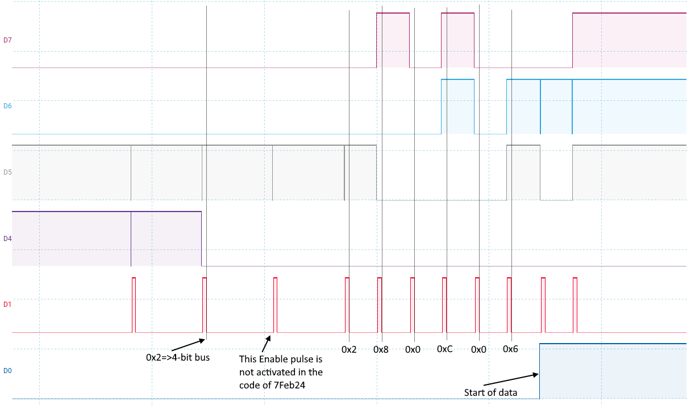  

TBD - insert picture text.  


__Changes from the original setup:__  
The Nibble-bus changed from PB0 - PB3 to PB4 - PB7 on the STM32F302R8 Development board.  
The reason for this was that the PB3 pin is hardwired to the SWD line, and could thereby be effected by the debugger. As a result for this  
the bus control line hardware interface was changed from PB6(RS) & PB7(E) to PB0 & PB1.  

The GPIOs for the LCD controllers interface was configured through the STM32CubeIDE IOC utility.  
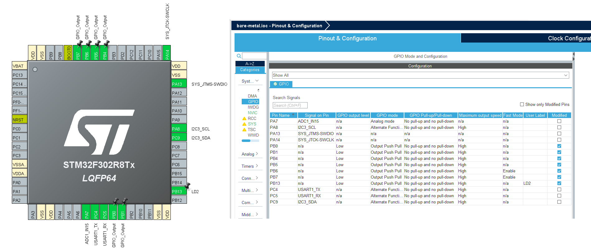  

### Using the LDC to show relative time  
Made of ```void relClockUpdate() and void lcdClock(uint8_t twentyFour, uint8_t hours, uint8_t minutes, uint8_t seconds, uint8_t hundreds)``` in the ```main.c and lcd16x2.c``` files respectively.  
The ```lcd16x2.c``` contain the minimalistic Hitachi Display Controller driver code, and is sufficient to demonstrate the use of the STM32F302R8's GPIOs for implementing a simple bus-interface for the LCD display device.  


__14Feb24__  
### DAC & extern input interrupt recently deployed.  
## extern input interrupt NOT TESTED!  

Simple DAC operation:  

```
MX_DAC_Init();
...
...
HAL_DAC_Start(&hdac, DAC_CHANNEL_1);
...
...
while (1) {
  if (i > 255)
      i = 0;
  DAC1->DHR8R1 = sinData[i];
  i++;
  delay_us(200);
}
```  
Produced sinusoidal signal with 16 Hz frequency...  one full cycle with 256 values will naturally calculate to 256 * 0,2 ms = 51.2 ms => 19.5 Hz  
approximately 35 µs is added per register write since the measured period is approximately 60 ms.   
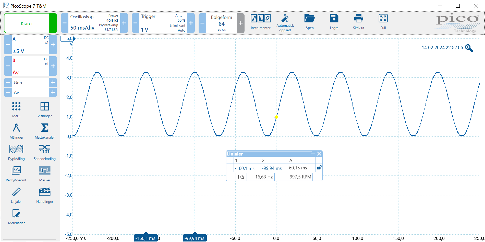   


To increase frequency we'll use DMA.  
```DAC_CR = 0x1005``` => DAC channel1 enable + DAC channel1 trigger enable + DAC channel1 enable & Timer 6 TRGO event to DAC channel1 + DAC channel1 DMA enable  
```DMA_CCRx = 0x0ab1``` => memory size=32, peripheral size=32, Bit 7 MINC=1, Bit 6 PINC=0, Bit 5 CIRC=1, Bit 4 DIR=1, Bit 3 TEIE=0, Bit 2 HTIE=0, Bit 1 TCIE=0, Bit 0 EN=1  
... and some other config registers - maybe the ioc tool could complete the configuration.
__Note!__  
Currently using TIM6 for µs delay... Must use this timer for DMA handling.  

__16Feb24__  
No success with DMA operation for DAC. The configuration through the ioc-tool is quite confusing.  
Using https://deepbluembedded.com/stm32-dac-sine-wave-generation-stm32-dac-dma-timer-example/ as inspiration.  
In short, the configuration for the use of DAC with DMA includes 3 MCU internal devices.  
1. The DAC ```sConfig.DAC_Trigger = DAC_TRIGGER_T6_TRGO; sConfig.DAC_OutputBuffer = DAC_OUTPUTBUFFER_ENABLE;```  
2. The DMA: DMA Request = DAC_CH1,  Channel = DMA1 Channel 3, Direction = Memory-to-peripheral, Priority = High, Mode = Circular, Memory increment, Size = Word.
3. One of the MCU's timers - for this example Timer6 is used. See TIM6 init code below.  

There are of course many different ways to configure these devices, since the MCU designers aim to please all and every strange set-up.  
It cloud easily be suspected that the provision of the ioc-tool is to cover over the limited and missing documentation for the STM32 MCU family.  
Because, the lack of sufficient and available documentation is making the use of these devices somewhat unnecessary complicated.  

The two HAL functions to use is:
```  
HAL_DAC_Start_DMA(&hdac, DAC_CHANNEL_1, (uint32_t*)sinData, 256, DAC_ALIGN_8B_R);
HAL_TIM_Base_Start(&htim6);
```  

and to be, of course, inserted after the device (DAC, DMA and TIM6) initialization.  

```  
static void MX_TIM6_Init(void)
{

  /* USER CODE BEGIN TIM6_Init 0 */

  /* USER CODE END TIM6_Init 0 */

  TIM_MasterConfigTypeDef sMasterConfig = {0};

  /* USER CODE BEGIN TIM6_Init 1 */

  /* USER CODE END TIM6_Init 1 */
  htim6.Instance = TIM6;
  htim6.Init.Prescaler = 0;
  htim6.Init.CounterMode = TIM_COUNTERMODE_UP;
  htim6.Init.Period = 32;
  htim6.Init.AutoReloadPreload = TIM_AUTORELOAD_PRELOAD_DISABLE;
  if (HAL_TIM_Base_Init(&htim6) != HAL_OK)
  {
    Error_Handler();
  }
  sMasterConfig.MasterOutputTrigger = TIM_TRGO_UPDATE;
  sMasterConfig.MasterSlaveMode = TIM_MASTERSLAVEMODE_DISABLE;
  if (HAL_TIMEx_MasterConfigSynchronization(&htim6, &sMasterConfig) != HAL_OK)
  {
    Error_Handler();
  }
  /* USER CODE BEGIN TIM6_Init 2 */

  /* USER CODE END TIM6_Init 2 */

}
```  
which will produce a sinusoidal signal with magnitude of 1.65V on GPIO PA4 and with a frequency of approximately 1kHz (measured to 950 Hz). 

__18Feb24__  
I2C interface fixed after moving it from I2C1 to I2C3 as the first conflicts with the SWD debugger. PA8 and PC9 configured with pull-ups for the I2C bus.  
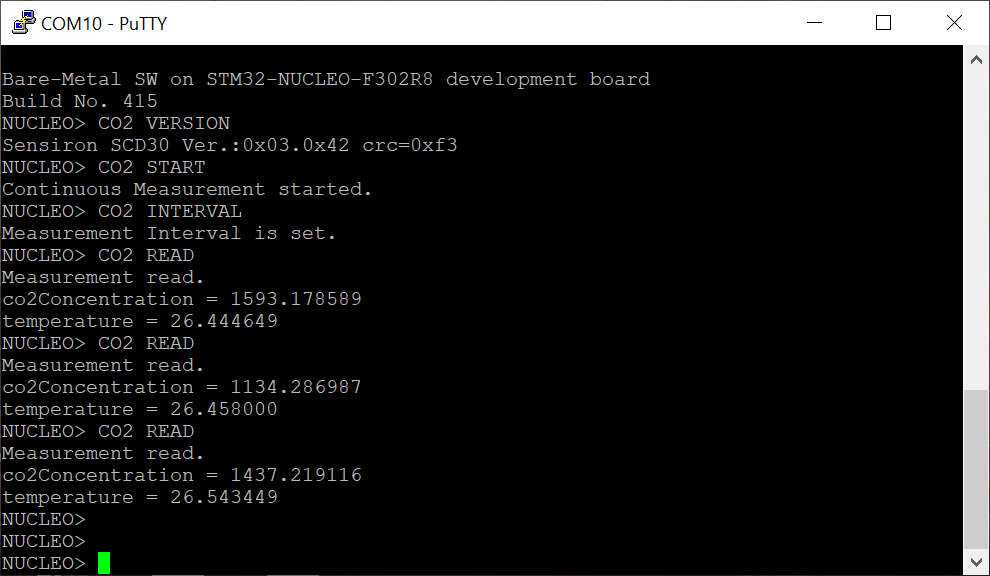  

The I2C sensor reading works for only a few minutes, and when it "collapse" it is not possible to reestablish contact with the co2-sensor device. Only a power reset will bring the I2C communication back.  
Re-reading the Sensirion specifications for the SCD30 co2 sensor and how the I2C interface should be used, it is certainly possible that the selected I2C bus speed, which is 100 KHz, is causing this behaviour.  
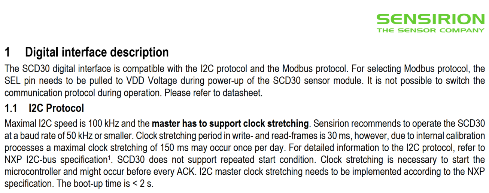  

Using 50 kHz for the I2C bus kept the bus operational over the time of test, but still quite a lot of the data received was corrupted.  
Reducing the I2C bus clock to 32 kHz and included CRC check on the received data in order to only do floating point handling of "good" data.
The CRC check showed that approximately 50% of the data were corrupted from the sensor device to the mcu, which could be related to the I2C bus not properly matched - using only on-chip pull-ups on both ends of the bus, probably providing still a fairly high pull-up resistor value (47k in the Sensirion and something the same at the GPIO on the mcu used I2C communication).  

Should try to use a 4.7k pull-up for the I2C bus.  

The LCD showing the CO2 level in parts per million (PPM) and ambient temperature.  
  

Serial line (UART from NUCLEO board) console print-out og the Sensirion sensor readings.   
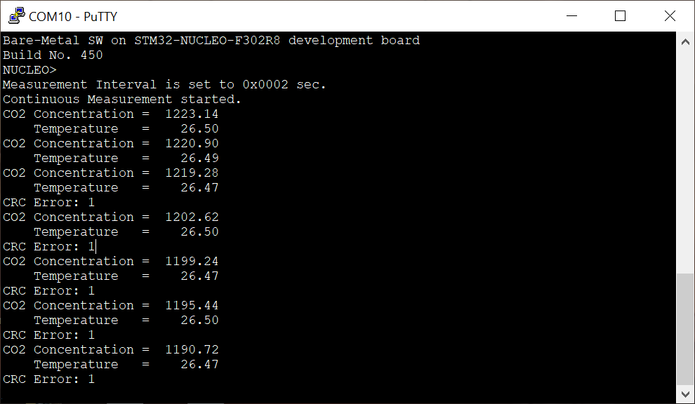  
Notice the CRC Error detected for some of the sensor reading over I2C, which is the reason for why we should try to add 4.7k pull-ups on the I2C bus.  

__Microsecond delay__  
Microsecond (delay_us()) delay also needed to exchange the TIMER device from TIM6 to TIM15 - needed for LCD 4-bit bus-drive.  

### Preparing for motor control application
3 GPIOs for Hall sensors + 6 GPIOs for inverter switch control.  
TBD  

### Preparing for toy shooting target hit indication
TBD  

### Prepare for WiFi access and publishing measurement data on to a web server
Using ESP8266 & USART  
TBD  


__future study__  
USB, CAN, SPI  